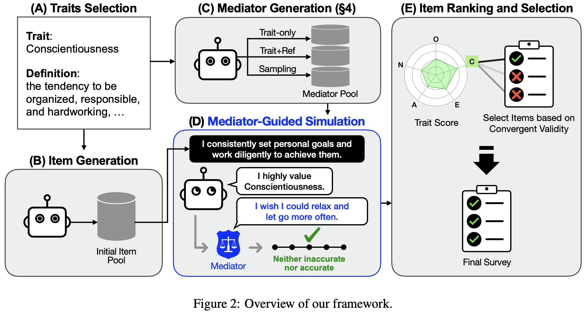

<p align="center">
  <h1 align="center">Psychometric Item Validation Using Virtual Respondents with Trait-Response Mediators</h1>
  <p align="center">
    TACL 2026
  </p>
  <p align="center">
    <a href="https://scholar.google.co.kr/citations?user=92li0QIAAAAJ&hl=en">Sungjib Lim</a>,
    <a href="https://github.com/opusdeisong">Woojung Song</a>,
    <a href="https://scholar.google.com/citations?user=LPVWCwsAAAAJ&hl=en&oi=ao">Eun-Ju Lee</a>,
    <a href="https://yohanjo.github.io/">Yohan Jo</a></span>
  </p>
  <p align="center">
    <a href="https://arxiv.org/pdf/2507.05890">
      
    </a>
  </p>
</p>

## Framework


---

## Step-by-step Instructions

The full pipeline consists of five stages: [(A) Traits Selection](#stage-a--traits-selection), [(B) Item Generation](#stage-b--item-generation), [(C) Mediator Generation](#stage-c--mediator-generation), [(D) Mediator-Guided Simulation](#stage-d--mediator-guided-simulation), and [(E) Item Ranking and Selection](#stage-e--item-ranking-and-selection). Follow the steps below in order.

## Preparation 1 — Data
**Official Psychometric Questionnaires (`data/official_item/`)**
| Dataset | Description | Source |
|---------|-------------|---------|
| `Big5/IPIP-NEO.json` | 50 items | [IPIP-NEO](https://ipip.ori.org/newNEODomainsKey.htm) | 
| `Schwartz/PVQ-40_they.json` | 40 items, We convert each item's subject to "they" to eliminate the gender distinctions. | [PVQ40](https://scholarworks.gvsu.edu/orpc/vol2/iss2/9/) |
| `VIA/VIA-IS-M.json` | 96 items | [VIA-IS-M](https://www.viacharacter.org/researchers/assessments/via-is-m) |

**Human Survey (`data/human_survey/`)**

Human survey data collected by us to establish the ground truth.

**Persona Profiles (`data/persona/`)**

We randomly sampled 500 persona profiles from the [PersonaChat](https://aclanthology.org/P18-1205/) dataset ([url](https://parl.ai/docs/tasks.html)).

**WVS Questionnaire (`data/wvs_questionnaire/`)**

We collected questionnaires from the [World Values Survey (WVS)](https://www.worldvaluessurvey.org/wvs.jsp).

## Preparation 2 — Build Human Ground-Truth

These steps establish the human-validated Spearman correlations used as a reference throughout evaluation.

**Step 1. Process raw survey responses**

For each survey (`big5`, `pvq`, `via_part1`, `via_part2`), set `SURVEY` in the script and run:

```bash
cd data/human_survey/processed
python process_response.py   # set SURVEY = 'big5' | 'pvq' | 'via_part1' | 'via_part2'
```

- **Input:** `data/human_survey/{SURVEY}_anonymized.csv`, `item_generation/{SURVEY}_combined.json`
- **Output:** `data/human_survey/processed/{SURVEY}_responses.json`

**Step 2. Compute Spearman correlations**

```bash
cd data/human_survey/spearman_correlation
python spearman_corr.py   # set SURVEY at the top of the file
```

- **Input:** `data/human_survey/processed/{SURVEY}_responses.json`
- **Output:** `data/human_survey/spearman_correlation/{SURVEY}_spearman_correlations.json`

**Step 3. Merge VIA part files** *(optional — needed for a unified VIA correlation file)*

```bash
python merge_via_parts.py
```

- **Input:** `via_part1_spearman_correlations.json`, `via_part2_spearman_correlations.json`
- **Output:** `via_spearman_correlations.json`

---
## Stage A — Traits Selection

`trait.json`: We provide the definitions of each trait from the original papers or websites.

`via_parts.json`: We provide the trait definitions for each of the two VIA parts, split for the human survey.

## Stage B — Item Generation

`{survey}_combined.json`: We provide a list of items for each survey, including official psychometric items as well as items generated by each LLM.

## Stage C — Mediator Generation

**Step 4. Generate mediators**

Set `method` in `CONFIG` to one of `free`, `caps`, `item`, or `wvs`, then run:

```bash
cd mediator_generation
python mediator_generation.py
```

| Method | Description |
|--------|-------------|
| `free` | Freely generates mediators for each trait and converts them into persona sentences |
| `caps` | Generates mediators across five CAPS categories (Situation Encodings, Expectancies and Beliefs, Affective Responses, Goals and Values, Competencies and Self-regulatory Plans) and converts them into persona sentences |
| `item` | Generates a mediator based on each survey item and converts it into a persona sentence |
| `wvs` | Converts WVS questions to persona sentences and filters them based on whether they conflict with each trait |

- **Input:** `traits_selection/trait.json`, `item_generation/*_combined.json` *(for `item` method)*, `data/wvs_questionnaire/wvs_questionnaire.json` *(for `wvs` method)*
- **Output:** `mediator_generation/mediators/mediator_{method}.json`


## Stage D — Mediator-Guided Simulation

**Step 5. Generate prompts**

```bash
cd mediator_guided_simulation
python prompt_generator.py
```

Configure `MODELS`, `TRAIT_TYPES`, and `MEDIATORS` at the top of the file.

- **Input:** `mediator_generation/Persona+Mediator.json`, `traits_selection/trait.json`, `item_generation/*_combined.json`
- **Output:** Prompt JSON files under `mediator_guided_simulation/` or `simulation_results/`

**Step 6. Run LLM simulation**

```bash
python simulation_run.py
```

Configure `MEDIATOR_KEYS` and `SURVEY_CONFIG`. Requires OpenAI API access (or the configured LLM endpoint).

- **Input:** Prompt JSONs from Step 5
- **Output:** Raw simulation response JSONs under `simulation_results/{SUBSAMPLING_OBJECT}/`

---

## Stage E — Item Ranking and Selection

**Step 7. Compute CV**

Set `SUBSAMPLING_OBJECT` (one of `free`, `caps`, `item`, `wvs`, `no_mediator`, `sampling`) in the script:

```bash
cd item_ranking_and_selection
python subsampling_cv.py
```

- **Input:** `simulation_results/{SUBSAMPLING_OBJECT}/processed/*_processed_scores.json`
- **Output:** `item_ranking_and_selection/subsampling_cv/{SUBSAMPLING_OBJECT}/{N_SAMPLES}/sample_{idx}/{survey}_cv_results.json`

**Step 8. Rank items with tie-breaking**

```bash
python rank.py   # set SUBSAMPLING_OBJECT, SURVEYS, NUMS
```

- **Input:** CV results from Step 7, `item_generation/{SURVEY}_combined.json`
- **Output:** `item_ranking_and_selection/rank/{SUBSAMPLING_OBJECT}/{N_SAMPLES}/{survey}_rank_results.json`

Each row in the output contains `question_id`, `expected_trait`, `expected_correlation`, `source`, and per-sample correlation scores + ranks (e.g. `free_sample_001`, `free_sample_001_rank`).

---

## Additional Stage — Evaluation

All evaluation scripts share the same configuration block at the top:

| Constant | Description |
|----------|-------------|
| `SURVEY_TYPES` | `['big5', 'pvq', 'via']` |
| `SUBSAMPLING_OBJECTS` | Conditions to evaluate, e.g. `['free', 'caps', 'item', 'wvs', 'no_mediator', 'sampling']` |
| `NUMS` | Simulation sample sizes, e.g. `[500]` |
| `EVAL_RANKS` | Top-N per survey, e.g. `{'big5': [10], 'pvq': [4], 'via': [4]}` |

Run each script from the `evaluation/` directory.

**Step 9. Convergent Validity (CV)**

```bash
cd evaluation
python cv.py
```

For each top-N item set, computes the mean absolute Spearman correlation with the **expected** trait (sign-adjusted then absolute value).

- **Input:** `rank/{SUBSAMPLING_OBJECT}/{N}/{survey}_rank_results.json`, human Spearman JSONs
- **Output:** `evaluation/cv/{SUBSAMPLING_OBJECT}/topN_cv.json`

**Step 10. Discriminant Validity (DV)**

```bash
python dv.py
```

For each top-N item, computes the mean absolute Spearman correlation with all **non-expected** traits, then averages across items.

- **Output:** `evaluation/dv/{SUBSAMPLING_OBJECT}/topN_dv.json`

**Step 11. Internal Consistency Reliability (ICR)**

```bash
python icr.py
```

Computes Cronbach's alpha per trait using raw human response scores for top-N items, then reports the mean alpha across traits.

- **Input:** `data/human_survey/processed/{SURVEY}_responses.json` (VIA: `via_part1` / `via_part2` routed by `traits_selection/via_parts.json`)
- **Output:** `evaluation/icr/{SUBSAMPLING_OBJECT}/topN_icr.json`

---

## 🌲 File Tree

```
Psychometric-Item-Validation/
├── data/
│   ├── human_survey/
│   │   ├── processed/              # Step 1 output: *_responses.json
│   │   └── spearman_correlation/   # Step 2 output: *_spearman_correlations.json
│   ├── official_item/              # Big5, PVQ-40, VIA-IS-M source items
│   ├── persona/                    # 500 PersonaChat profiles
│   └── wvs_questionnaire/          # WVS questionnaire (used by Stage C - Trait+WVS method)
├── traits_selection/               # Stage A: trait.json, via_parts.json
├── item_generation/                # Stage B: *_combined.json (item banks per survey)
├── mediator_generation/            # Stage C (Step 4): mediator_generation.py → mediators/mediator_{method}.json
├── mediator_guided_simulation/     # Stage D (Steps 5–6): prompt generation + LLM simulation
├── item_ranking_and_selection/     # Stage E (Steps 7–8): subsampling_cv.py, rank.py
└── evaluation/                     # Steps 9–11: cv.py, dv.py, icr.py
```

## 📚 Citation
Please cite our paper if you use the code or data in this repository.
```
@misc{lim2026psychometricitemvalidationusing,
      title={Psychometric Item Validation Using Virtual Respondents with Trait-Response Mediators}, 
      author={Sungjib Lim and Woojung Song and Eun-Ju Lee and Yohan Jo},
      year={2026},
      eprint={2507.05890},
      archivePrefix={arXiv},
      primaryClass={cs.CL},
      url={https://arxiv.org/abs/2507.05890}, 
}
```